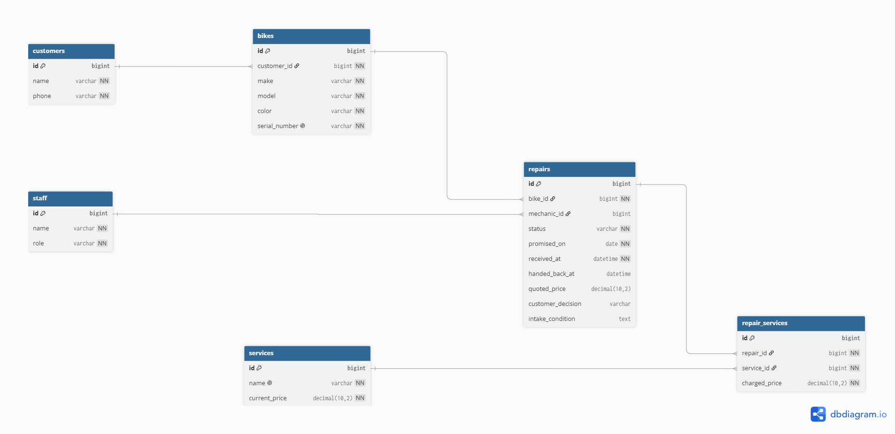
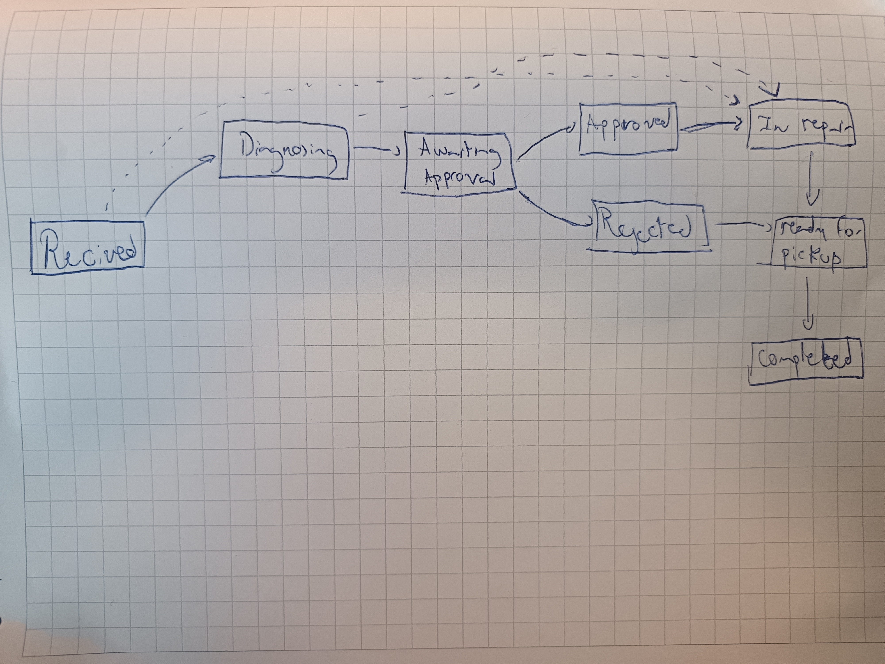

## Domain Model
Table customers {
  id bigint [pk, increment]
  name varchar [not null]
  phone varchar [not null]
}

Table bikes {
  id bigint [pk, increment]
  customer_id bigint [not null]
  make varchar [not null]
  model varchar [not null]
  color varchar [not null]
  serial_number varchar [not null, unique]
}

Table staff {
  id bigint [pk, increment]
  name varchar [not null]
  role varchar [not null]
}

Table repairs {
  id bigint [pk, increment]
  bike_id bigint [not null]
  mechanic_id bigint

  status varchar [not null, default: 'received']

  promised_on date [not null]
  received_at datetime [not null]
  handed_back_at datetime

  quoted_price decimal(10,2)
  customer_decision varchar

  intake_condition text
}

Table services {
  id bigint [pk, increment]
  name varchar [not null, unique]
  current_price decimal(10,2) [not null]
}

Table repair_services {
  id bigint [pk, increment]
  repair_id bigint [not null]
  service_id bigint [not null]
  charged_price decimal(10,2) [not null]
}

Ref: bikes.customer_id > customers.id
Ref: repairs.bike_id > bikes.id
Ref: repairs.mechanic_id > staff.id
Ref: repair_services.repair_id > repairs.id
Ref: repair_services.service_id > services.id

## Repair lifecycle

## Entity -> story

| Entity          | Story that requires it                                                                    |
| --------------- | ----------------------------------------------------------------------------------------- |
| `Customer`      | As a Counter Worker, I want to register a bike when it arrives...                         |
| `Bike`          | As a Counter Worker, I want to register a bike when it arrives...                         |
| `Staff`         | As a Mechanic, I want to know the bike's current repair status...                         |
| `Repair`        | As a Mechanic, I want to know the bike's current repair status...                         |
| `Service`       | As a Visitor, I want to see the available services and their prices...                    |
| `RepairService` | As a Counter Worker, I want to see the price charged for each service in a past repair... |

## Thing vs copy of thing

Each physical bike is represented by its own `Bike` row and is uniquely identified by its serial number. Make, model and colour describe the bike but do not identify the individual object. Therefore, two blue Trek Marlins are represented as two different bikes with different serial numbers. A model based on one “Trek Marlin” row with a quantity of two would not be able to determine which bike belongs to which customer or which repair history belongs to each physical bike.

## Derived vs Stored Values

### Derived value: Repair total

The total price of a repair is not stored directly in the `repairs` table.

Instead, it is derived from the sum of the `charged_price` values of all `repair_services` associated with that repair.

This avoids storing duplicated information and reduces the risk of inconsistencies.

### Stored value: Charged service price

The `charged_price` in `repair_services` is stored even though it may look derivable from `services.current_price`.

It must be stored because the listed price of a service can change over time, and a repair may also receive a discount.

Therefore, the charged price represents the historical price actually applied to that specific repair.